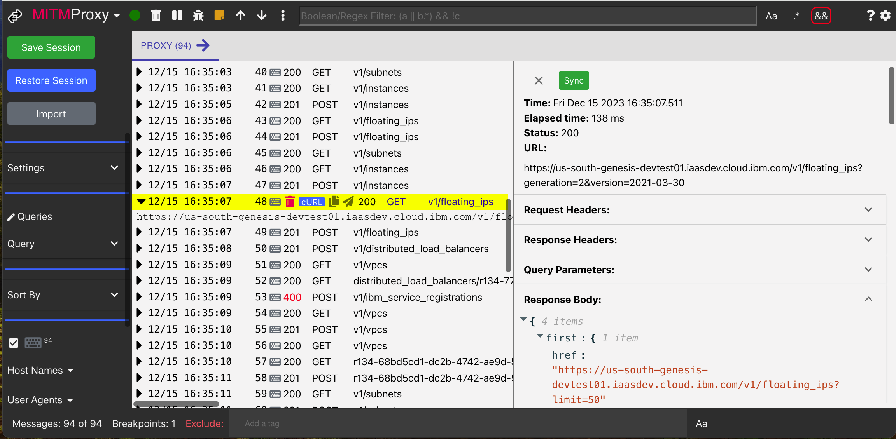
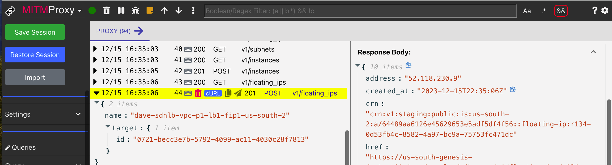
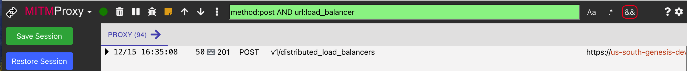
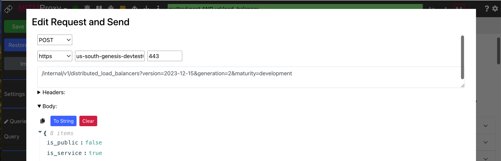
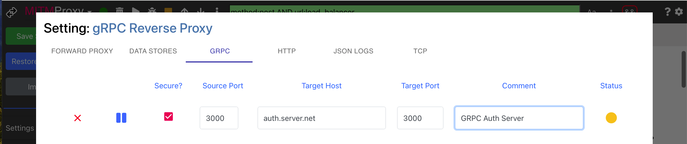
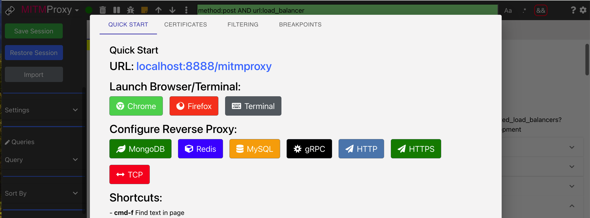

<h1 align="center" style="border-bottom: none;">MITM Proxy UI</h1>

MITM debugging proxy UI to view and modify the HTTP and HTTPS (SSL) traffic between your machine and the Internet.  Also supports reverse proxy protocols: HTTP, HTTPS, MongoDB, Redis, MySQL and gRPC.

### Try AllProxy Online

To try a `readonly` demo:
* Click [Try it out](https://allproxy.ddns.net/mitmproxy)
* On the left side panel click the `Restore Session` button
* From the Restore Session Modal click `Restore` to restore a sample session

### Install

> Clone repo and run: **npm install && npm start**

> Open `MITM Proxy` in browser;
>    * [localhost:8888/mitmproxy](http://localhost:8888/mitmproxy)

### Updating

The MITM Proxy uses the [allproxy](https://github.com/allproxy/allproxy) package.

To update the `allproxy` npm package run:
> **npm update**

### HTTPS Proxy
MITM Proxy is a man-in-the-middle server that captures the traffic between your application and web server.   You can inspect the complete HTTP request and response.

### Advanced Filtering
Use advanced filter criteria to find what you're looking for.   Use complex boolean expressions to match the protocol, payload, URL, headers, and just about any part of the request or response message.

### Breakpoints
Set breakpoints to stop the HTTP request and optionally modify it before sending it to the web server.

### Modify and Resend Requests
Modify and resend any captured HTTP requests.

### Reverse Proxy
Resource proxy protocols include: MongoDb, Redis, MySQL, qGRPC, HTTP, HTTPS and TCP.

### Integrated Online Help
The Help modal helps you configure and use the application.

## License

This code is licensed under the [MIT License](https://opensource.org/licenses/MIT).

  
